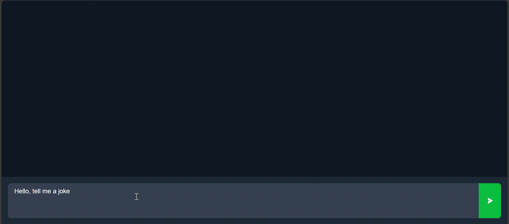

<h2>Demo</h2>

<h2>About the Project</h2>

This is a simple AI chatbot built with Next.js that integrates with the OpenAI
Responses API, allowing users to submit text inputs and receive either text or
image outputs.

After getting an API key from the
<a href='https://platform.openai.com/'>OpenAI Platform</a>, you just need to
create a `.env` file in the project's root directory and add the following
environment variables:

<pre>
OPENAI_API_KEY=your_api_key
OPENAI_MODEL_ID=gpt-4.1-nano
MAX_OUTPUT_TOKENS=4096
NEXT_PUBLIC_MAX_INPUT_LENGTH=4000
</pre>

Finally, make sure to replace `your_api_key` with your actual API key, and feel
free to adjust the other values as needed — just keep in mind that the
`OPENAI_MODEL_ID` must be compatible with the Responses API and support the
`image_generation` tool.